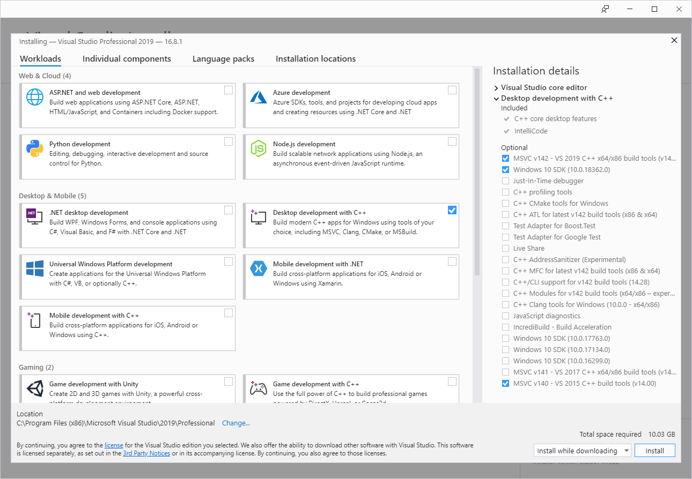

# HowTo-setup-an-UEFI-Development-PC

1. install a Windows 10 64 PC 
   i.  get MediaCreationTool https://go.microsoft.com/fwlink/?LinkId=691209 and download Win10 1903 
2. install GIT: https://github.com/git-for-windows/git/releases/download/v2.23.0.windows.1/Git-2.23.0-64-bit.exe 
   NOTE: update to *GIT v2.23* because of [fixed submodule issue](https://github.com/git/git/blob/v2.23.0/Documentation/RelNotes/2.23.0.txt)
3. install/extract the ASL/ACPI compiler to C:\ASL -> https://acpica.org/sites/acpica/files/iasl-win-20160527.zip
4. install Python ver 2.7 to C:\Python27 -> https://www.python.org/ftp/python/2.7/python-2.7.amd64.msi
5. install Netwide Assembler ver. 2.13 to C:\NASM (NOTE: change default installation path) -> 

   https://www.nasm.us/pub/nasm/releasebuilds/2.13/win64/nasm-2.13-installer-x64.exe
6. install Visual Studio 2019 
   https://docs.microsoft.com/en-us/visualstudio/releases/2019/release-notes 
   
7. install the **Windows 8.1 SDK**, needed for the VS2015 based EDK2 buildprocess. 
**Windows 8.1 SDK** is provided in the Microsoft SDK archive at:  https://developer.microsoft.com/en-us/windows/downloads/sdk-archive,  or direct link:  
https://go.microsoft.com/fwlink/p/?LinkId=323507 
   NOTE: **Windows 8.1 SDK** is removed from VS2019, but still available with VS2017. VS2017 itself is not available
   anymore for free.
   
## Nice to have / optional
8. install tortoiseGIT: https://download.tortoisegit.org/tgit/2.8.0.0/TortoiseGit-2.8.0.0-64bit.msi
9. install BeyondCompare -> https://www.scootersoftware.com/BCompare-4.2.10.23938.exe 
   i. add to `%USERPROFILE%\.gitconfig` 
   `[diff]` 
	`  tool = bc4` 
   `[difftool "bc4"]` 
	   `  cmd = \"C:\\Program Files\\Beyond Compare 4\\BCompare.exe\" \"$LOCAL\" \"$REMOTE\"` 
   `[difftool]` 
	   `  prompt = false` 
   `[merge]` 
	   `  tool = bc4` 
   `[mergetool "bc4"]` 
	   `  cmd = \"C:\\Program Files\\Beyond Compare 4\\BCompare.exe\" \"$LOCAL\" \"$REMOTE\" \"$BASE\" \"$MERGED\"` 
	   `  trustExitCode = true` 
10. install Acrobat Reader DC (offline) -> ftp://ftp.adobe.com/pub/adobe/reader/win/AcrobatDC/1901220040/AcroRdrDCUpd1901220040.msp 
11. install compression tools 
   i. WinRar -> https://www.rarlab.com/rar/winrar-x64-571.exe 
   ii. 7Zip -> https://www.7-zip.org/a/7z1900-x64.exe 
12. install DoxyGen -> https://sourceforge.net/projects/doxygen/files/latest/download 
   install HTML Help Workshop -> https://www.microsoft.com/en-us/download/confirmation.aspx?id=21138&6B49FDFB-8E5B-4B07-BC31-15695C5A2143=1
13. install Latex -> https://miktex.org/download/ctan/systems/win32/miktex/setup/windows-x64/basic-miktex-2.9.7152-x64.exe 
14. install Windows Subsystem for Linux WSL: 
  i. run PowerShell (as administrator): Enable-WindowsOptionalFeature -Online -FeatureName Microsoft-Windows-Subsystem-Linux 
  ii.install Ubuntu 18.4: https://aka.ms/wsl-ubuntu-1804 
  iii. run in the linux shell: sudo apt update 
  iv.  run in the linux shell: sudo apt install gcc 
15. disable Microsoft Defender: Regedit -> HKEY_LOCAL_MACHINE\SOFTWARE\Policies\Microsoft\Windows Defender\DisableAntiSpyware = 1
