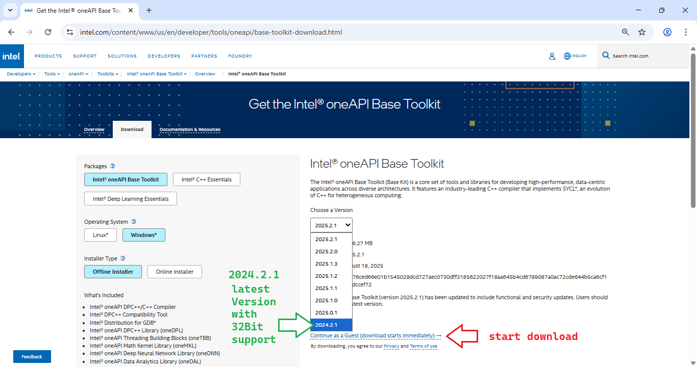

# How to Set Up a UEFI Development PC
## Preparation for ***Portable Projects***
**NOTE:** To avoid build failures caused by incomplete or misconfigured build machines, upcoming and updated projects run their build tools locally within the project folder.

### Always start with `LAUNCH.BAT`!<br>The build environment is installed (once) locally and the environment (`PATH`) is initialized every time you start `LAUNCH.BAT`.

Currently the tools listed below are in use:
* [wget.exe](https://eternallybored.org/misc/wget/1.21.3/64/wget.exe) – downloads any missing tools during the initial `LAUNCH.BAT` run (or manually via a web search)
* [EnterpriseWDK_rs2_release_15063_20170317-1834.zip](https://go.microsoft.com/fwlink/p/?LinkID=846038) – Microsoft EWDK 1703
* [nasm-2.16.01-win64.zip](https://www.nasm.us/pub/nasm/releasebuilds/2.16.01/win64/nasm-2.16.01-win64.zip) – NASM assembler
* [python-3.10.11-embed-win64.zip](https://www.python.org/ftp/python/3.10.11/python-3.10.11-embed-amd64.zip) – Embedded Python
* [openssl-1.0.2r-x64_86-win64.zip](https://indy.fulgan.com/SSL/openssl-1.0.2r-x64_86-win64.zip) – OpenSSL
* [iasl-win-20230628.zip](https://downloadmirror.intel.com/783546/iasl-win-20230628.zip) – Intel ASL compiler
* [flex-2.5.4a-1-bin.zip](https://downloads.sourceforge.net/project/gnuwin32/flex/2.5.4a-1/flex-2.5.4a-1-bin.zip) – Lexical analyzer generator
* [bison-2.4.1-bin.zip](https://downloads.sourceforge.net/project/gnuwin32/bison/2.4.1/bison-2.4.1-bin.zip) – Parser generator
* [libintl-0.14.4-bin.zip](https://downloads.sourceforge.net/project/gnuwin32/libintl/0.14.4/libintl-0.14.4-bin.zip) – Support DLL for FLEX/BISON
* [libiconv-1.9.2-1-bin.zip](https://downloads.sourceforge.net/project/gnuwin32/libiconv/1.9.2-1/libiconv-1.9.2-1-bin.zip) – Support DLL for FLEX/BISON
* [regex-2.7-bin.zip](https://downloads.sourceforge.net/project/gnuwin32/regex/2.7/regex-2.7-bin.zip) – Support DLL for FLEX/BISON

To avoid multiple lengthy downloads, the original archives can optionally be downloaded once per build machine and stored in a folder referenced by the environment variable `MYDOWNLOADS`.


To set this up:
1. Create a folder `MYDOWNLOADS`, e.g. run: `cmd /c MD %USERPROFILE%\MYDOWNLOADS`
2. Press Win+R → `control.exe` → User Accounts → Change my environment variables
3. Create environment variable `MYDOWNLOADS`, e.g. `MYDOWNLOADS=%USERPROFILE%\MYDOWNLOADS`
4. (Optional) Create environment variable `MYUSBSHARE`, e.g. `MYUSBSHARE=F:\` to automatically copy target files to an exchange drive via batch files or Visual Studio build events


## Install a Windows 11/10 PC
* Download the Media Creation Tool for Windows 11: https://go.microsoft.com/fwlink/?linkid=2156295
  or
* Download the Media Creation Tool for Windows 10: https://go.microsoft.com/fwlink/?LinkId=691209

### Windows 11 Configuration Hint
Restore the classic (full) context menu in Windows. Run in a Command Prompt:
```
reg add HKCU\Software\Classes\CLSID\{86ca1aa0-34aa-4e8b-a509-50c905bae2a2}\InprocServer32 /ve /d "" /f
```

* [private: Windows Pro Activation key](https://github.com/KilianKegel/remember/blob/master/Win10ProActivation.md)
* [private: Windows Pro N and KN Activation key](https://github.com/KilianKegel/remember/blob/master/Win10ProNActivation.md)

## Install Visual Studio
[](https://visualstudio.microsoft.com/insiders)
1. [Download VS2026 Community Insider](https://aka.ms/vs/18/insiders/vs_Community.exe) 
2. Configure **Desktop development with C++** workload and **Individual Components** (optional for LLVM/Clang support):<br>
   
   

## Install Git
[](https://github.com/git-for-windows/git/releases/download/v2.51.0.windows.2/Git-2.51.0.2-64-bit.exe)

# Nice to have / optional
[](https://www.firefox.com/en-US/thanks/)

[](https://www.scootersoftware.com/files/BCompare-4.4.7.28397.exe)

[](https://download.tortoisegit.org/tgit/2.17.0.0/TortoiseGit-2.17.0.2-64bit.msi)

[](https://get.adobe.com/reader/otherversions)

[](https://www.win-rar.com/fileadmin/winrar-versions/winrar/winrar-x64-713.exe)

[](https://www.7-zip.org/a/7z2501-x64.msi)

[](https://github.com/TeraTermProject/teraterm/releases/download/v5.5.1/teraterm-5.5.1-x64.exe)

[](https://rweverything.com/downloads/RwX64V1.7.zip) **RWEverything**<br>
**Run as administrator and reboot  . . .**
```
reg add HKEY_LOCAL_MACHINE\SYSTEM\CurrentControlSet\Control\CI\Config /v VulnerableDriverBlocklistEnable /t REG_DWORD /d 0 /f
```


## adjust *.gitconfig*
add to `%USERPROFILE%\.gitconfig`:<br>
```
[diff]
  tool = bc4
[difftool "bc4"]
  cmd = \"C:\\Program Files\\Beyond Compare 4\\BCompare.exe\" \"$LOCAL\" \"$REMOTE\"
[difftool]
  prompt = false
[merge]
  tool = bc4
[mergetool "bc4"]
  cmd = \"C:\\Program Files\\Beyond Compare 4\\BCompare.exe\" \"$LOCAL\" \"$REMOTE\" \"$BASE\" \"$MERGED\"
  trustExitCode = true
```
## Install FTDI serial-USB driver -> https://www.ftdichip.com/Drivers/CDM/CDM21228_Setup.zip<br>
## Install TeraTerm -> https://ttssh2.osdn.jp/index.html.en<br>
## Install DoxyGen -> https://sourceforge.net/projects/doxygen/files/latest/download<br>

## Install Latex -> https://miktex.org/download/ctan/systems/win32/miktex/setup/windows-x64
## Install Windows Subsystem for Linux WSL2 / Ubuntu 22.04.2

**NOTE: In order to run WSL2 on a HYPER-V virtual machine, enable Nested Virtualization on the Hyper-V Manager for this particular virtual machine, while the VM is in OFF state:**

* run PowerShell as administrator: `Set-VMProcessor <"VIRTUALMACHINENAME"> -ExposeVirtualizationExtensions $true`
* in case the *Virtual Machine Name* includes special characters, e.g. (), use quotation marks


https://docs.microsoft.com/en-us/windows/wsl/install-win10


**NOTE: In order to start WSL2 you have to run as an administrator:**
`bcdedit /set hypervisorlaunchtype auto`
	
* download install script:<br>
  `wget https://raw.githubusercontent.com/KilianKegel/HowTo-setup-a-YOCTO-Development-PC/master/install.sh`
* set x attribute: `chmod +x install.sh`
* run `./install.sh`
	
## Disable Microsoft Defender
If the build machine is physically protected from malware, it is possible to disable the virus protection completely
to save energy and to speedup build process.

Create `DEFDIS.REG` registry script below and run it on the platform:
```
Windows Registry Editor Version 5.00

[HKEY_LOCAL_MACHINE\SOFTWARE\Policies\Microsoft\Windows Defender]
"DisableAntiSpyware"=dword:00000001
"DisableAntiVirus"=dword:00000001
"DisableRealtimeMonitoring"=dword:00000001
"DisableRoutinelyTakenAction"=dword:00000001
"DisableSpecialRunningModes"=dword:00000001
"ServiceKeepAlive"=dword:00000001

[HKEY_LOCAL_MACHINE\SOFTWARE\Policies\Microsoft\Windows Defender\Policy Manager]

[HKEY_LOCAL_MACHINE\SOFTWARE\Policies\Microsoft\Windows Defender\Real-Time Protection]
"DisableBehaviourMonitoring"=dword:00000001
"DisableRealtimeMonitoring"=dword:00000001
"DisableScanOnRealtimeEnable"=dword:00000001
"DisableOnAccessProtection"=dword:00000001

[HKEY_LOCAL_MACHINE\SOFTWARE\Policies\Microsoft\Windows Defender\Signature Updates]
"ForceUpdateFromMU"=dword:00000001

[HKEY_LOCAL_MACHINE\SOFTWARE\Policies\Microsoft\Windows Defender\Spynet]
"DisableBlockAtFirstSeen"=dword:00000001
```

## Install Intel C++ Compiler 2024 Toolchain


[](https://www.intel.com/content/www/us/en/developer/tools/oneapi/base-toolkit-download.html)

#### NOTE: oneAPI Toolkit runs on VS2022 and VS2019 only!

## Install yED https://www.yworks.com/products/yed/download
## Install QT http://download.qt.io/official_releases/qt/5.14/5.14.2/qt-opensource-windows-x86-5.14.2.exe
## Install GIMP https://download.gimp.org/mirror/pub/gimp/v2.10/windows/gimp-2.10.22-setup.exe
## Install BGINFO https://download.sysinternals.com/files/BGInfo.zip
* copy BGINFO64.EXE to %USERPROFILE%\AppData\Local\Microsoft\WindowsApps
* create %USERPROFILE%\AppData\Roaming\Microsoft\Windows\Start Menu\Programs\Startup\BGINFO.BAT that contains:
	```
	BGINFO64.EXE /timer:0
	```
## Install File Commander FCW https://www.heise.de/download/product/file-commander-7157/download/danke?id=7157-1

### finally: adjust PATH variable
<br>
1: windows-R -> control.exe -> User Accounts -> Change my environment variables<br>
2. add to PATH:<br>
```
c:\progra~1\beyond~1                           --> bcompare.exe
c:\progra~1\winrar                             --> rar.exe
c:\progra~1\7-zip                              --> 7z.exe
c:\progra~2\teraterm                           --> ttermpro.exe
c:\progra~2\FILECO~1                           --> fcw.exe
c:\progra~1\MICROS~1\2022\COMMUN~1\Common7\ide --> devenv.exe
c:\GnuWin32\bin                                --> FLEX/BISON
```
### Vintage DDK
* [Windows Server 2003 SP1 DDK](http://download.microsoft.com/download/9/0/f/90f019ac-8243-48d3-91cf-81fc4093ecfd/1830_usa_ddk.iso)
* [WDK 7.1.0](http://download.microsoft.com/download/4/a/2/4a25c7d5-efbe-4182-b6a9-ae6850409a78/grmwdk_en_7600_1.iso)
* [EnterpriseWDK_rs2_release_15063_20170317-1834](https://go.microsoft.com/fwlink/p/?LinkID=846038)
### Microsoft DDK download page
* [Download the Windows Driver Kit (WDK)](https://learn.microsoft.com/en-us/windows-hardware/drivers/download-the-wdk)
* [Other WDK downloads](https://learn.microsoft.com/en-us/windows-hardware/drivers/other-wdk-downloads)
