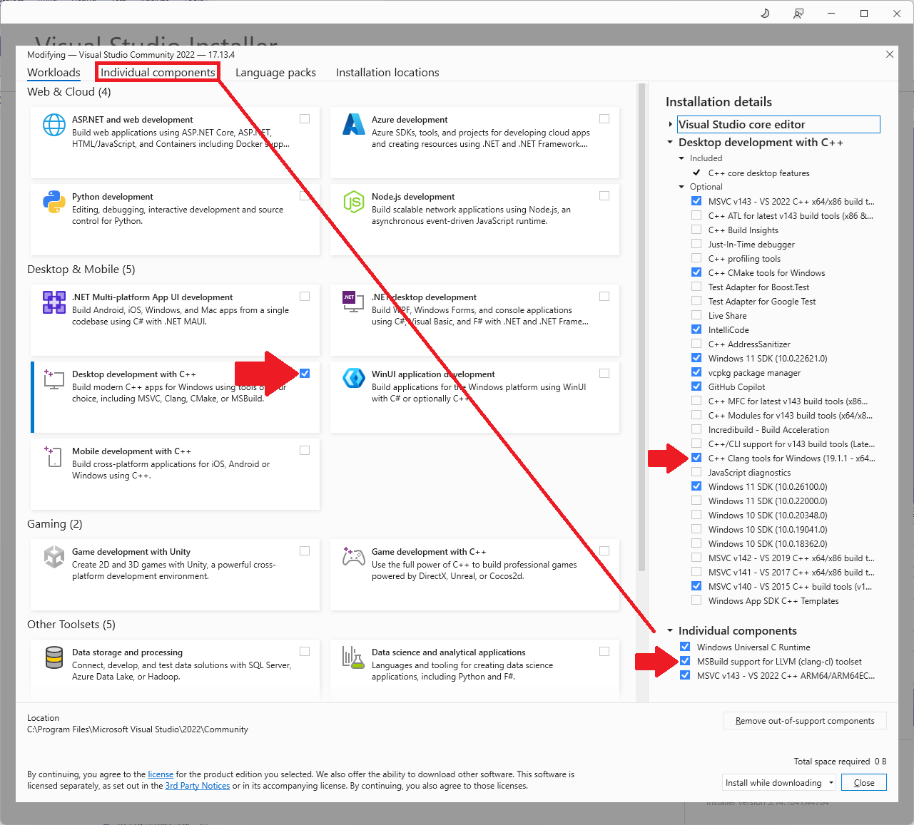

# Howto-setup-a-UEFI-Development-PC
**NOTE:** To build all projects from https://github.com/KilianKegel the tools below are absolutely needed
* NASM
* ASL
* Windows 8.1 SDK (for  EDK2020-MinnowBoard)
* FLEX/BISON (for the Visual-ACPICA-for-UEFI-Shell project)
## Preparation for upcoming ***portable*** projects
**NOTE:** To avoid build failure due to incomplete installed or wrongly configured build machines,<br> 
upcoming and updated projects run their build tools within the project folder.

The build tools are installed and initialized when starting **LAUNCH.BAT** the first time.

Currently the tools listed below are in use:
* [wget.exe](https://eternallybored.org/misc/wget/1.21.3/64/wget.exe), **WGET** to download missing tools at initial **LAUNCH.BAT**, <br>or manually via https://www.google.com/search?q=download+WGET+windows+binary
* [EnterpriseWDK_rs2_release_15063_20170317-1834.zip](https://go.microsoft.com/fwlink/p/?LinkID=846038), **Microsoft EWDK1703**
* [nasm-2.16.01-win64.zip](https://www.nasm.us/pub/nasm/releasebuilds/2.16.01/win64/nasm-2.16.01-win64.zip), **NASM** assembler
* [python-3.10.11-embed-win64.zip](https://www.python.org/ftp/python/3.10.11/python-3.10.11-embed-amd64.zip), **PYTHON**
* [openssl-1.0.2r-x64_86-win64.zip](https://indy.fulgan.com/SSL/openssl-1.0.2r-x64_86-win64.zip), **OPENSSL**
* [iasl-win-20230628.zip](https://downloadmirror.intel.com/783546/iasl-win-20230628.zip), **Intel ASL compiler**
* [flex-2.5.4a-1-bin.zip](https://downloads.sourceforge.net/project/gnuwin32/flex/2.5.4a-1/flex-2.5.4a-1-bin.zip), **lexical analyser generator**
* [bison-2.4.1-bin.zip](https://downloads.sourceforge.net/project/gnuwin32/bison/2.4.1/bison-2.4.1-bin.zip), **parser generator**
* [libintl-0.14.4-bin.zip](https://downloads.sourceforge.net/project/gnuwin32/libintl/0.14.4/libintl-0.14.4-bin.zip), **support DLL for FLEX/BISON**
* [libiconv-1.9.2-1-bin.zip](https://downloads.sourceforge.net/project/gnuwin32/libiconv/1.9.2-1/libiconv-1.9.2-1-bin.zip), **support DLL for FLEX/BISON**
* [regex-2.7-bin.zip](https://downloads.sourceforge.net/project/gnuwin32/regex/2.7/regex-2.7-bin.zip), **support DLL for FLEX/BISON**

To avoid multiple, lengthy downloads the original images *can, optionally,* downloaded once to
each build machine and stored in a folder, that is assigned to an *environment variable* **MYDOWNLOADS**.


To do so, simply
1. create a folder **MYDOWNLOADS**, e.g. run **"cmd /c MD %USERPROFILE%\MYDOWNLOADS"**
2. windows-R -> control.exe -> User Accounts -> Change my environment variables
3. create an *environment variable* **MYDOWNLOADS**, e.g. **MYDOWNLOADS=%USERPROFILE%\MYDOWNLOADS**:
4. create an *environment variable* **MYUSBSHARE**, e.g. **MYUSBSHARE=F:\\** to automatically copy target files to an exchange drive per batch files or Visual Studio *build events*

<br>


## Install a Windows 11/10 PC<br>
   *  get `MediaCreationTool` https://go.microsoft.com/fwlink/?linkid=2156295 and download Windows 11<br>
   	or
   *  get `MediaCreationTool` https://go.microsoft.com/fwlink/?LinkId=691209 and download Windows 10<br>
### Windows 11 configuration hint
   1. Restore Classic (Full) Context Menu in Windows<br>
      run in command prompt window:<br>
      `reg add HKCU\Software\Classes\CLSID\{86ca1aa0-34aa-4e8b-a509-50c905bae2a2}\InprocServer32 /ve /d "" /f`<br>

## Install Visual Studio 2022<br>
   1. download: https://docs.microsoft.com/en-us/visualstudio/releases/2022/release-notes<br>
   2. configure setup (additional for **LLVM/CLANG support**):
   
   
## Install GIT: https://github.com/git-for-windows/git/releases/download/v2.49.0.windows.1/Git-2.49.0-64-bit.exe<br>
## Install/extract the ASL/ACPI compiler to C:\ASL -> https://acpica.org/sites/acpica/files/iasl-win-20160527.zip
## Install Python https://www.python.org/ftp/python/3.7.4/python-3.7.4-amd64.exe<br>
   
   NOTE: If Python is installed from the Microsoft AppStore it can not be de-installed anymore!
## Install Netwide Assembler ver. 2.15.05 to C:\NASM 

**NOTE: change default installation path to C:\NASM**

   https://www.nasm.us/pub/nasm/releasebuilds/2.15.05/win64/nasm-2.15.05-installer-x64.exe
   
## Install the **Windows 8.1 SDK**, needed for the VS2015 based EDK2 buildprocess.<br>
**Windows 8.1 SDK** is provided in the Microsoft SDK archive at:<br> https://developer.microsoft.com/en-us/windows/downloads/sdk-archive, <br>or direct link: <br>
https://go.microsoft.com/fwlink/p/?LinkId=323507<br>
   NOTE: **Windows 8.1 SDK** is removed from VS2022, but still available with VS2017. VS2017 itself is not available
   anymore for free.

   NOTE: **Windows 8.1 SDK** is just needed to solve one single issue: Provide Ressource Compiler **RC.EXE** to EDK2 build process.
   Environment variables `WINSDK81x86_PREFIX` and `WINSDK81_PREFIX` are in use in EDK2 build, and could be adjusted to use newer SDK too...
   

## Install FLEX/BISON to C:\GnuWin32\bin, needed for the ACPI/ACPICA project<br>
https://acpica.org/downloads/windows-source<br>
   i. add **C:\GnuWin32\bin** to [path](README.md#finally-adjust-path-variable)

   
# Nice to have / optional
## Install BeyondCompare -> https://www.scootersoftware.com/files/BCompare-4.4.7.28397.exe<br>
## Install tortoiseGIT: https://download.tortoisegit.org/tgit/2.17.0.0/TortoiseGit-2.17.0.2-64bit.msi<br>
add to `%USERPROFILE%\.gitconfig`:<br>
```
[diff]
  tool = bc4
[difftool "bc4"]
  cmd = \"C:\\Program Files\\Beyond Compare 4\\BCompare.exe\" \"$LOCAL\" \"$REMOTE\"
[difftool]
  prompt = false
[merge]
  tool = bc4
[mergetool "bc4"]
  cmd = \"C:\\Program Files\\Beyond Compare 4\\BCompare.exe\" \"$LOCAL\" \"$REMOTE\" \"$BASE\" \"$MERGED\"
  trustExitCode = true
```
## Install Acrobat Reader DC  -> https://get.adobe.com/reader/otherversions/<br>
## Install compression tools<br>
   i. WinRar -> https://www.rarlab.com/rar/winrar-x64-571.exe<br>
   ii. 7Zip -> https://www.7-zip.org/a/7z1900-x64.exe<br>
## Install FTDI serial-USB driver -> https://www.ftdichip.com/Drivers/CDM/CDM21228_Setup.zip<br>
## Install TeraTerm -> https://ttssh2.osdn.jp/index.html.en<br>
## Install DoxyGen -> https://sourceforge.net/projects/doxygen/files/latest/download<br>

## Install Latex -> https://miktex.org/download/ctan/systems/win32/miktex/setup/windows-x64
## Install Windows Subsystem for Linux WSL2 / Ubuntu 22.04.2

**NOTE: In order to run WSL2 on a HYPER-V virtual machine, enable Nested Virtualization on the Hyper-V Manager for this particular virtual machine, while the VM is in OFF state:**

* run PowerShell as administrator: `Set-VMProcessor <"VIRTUALMACHINENAME"> -ExposeVirtualizationExtensions $true`
* in case the *Virtual Machine Name* includes special characters, e.g. (), use quotation marks


https://docs.microsoft.com/en-us/windows/wsl/install-win10


**NOTE: In order to start WSL2 you have to run as an administrator:**
`bcdedit /set hypervisorlaunchtype auto`
	
* download install script:<br>
  `wget https://raw.githubusercontent.com/KilianKegel/HowTo-setup-a-YOCTO-Development-PC/master/install.sh`
* set x attribute: `chmod +x install.sh`
* run `./install.sh`
	
## Disable Microsoft Defender
If the build machine is physically protected from malware, it is possible to disable the virus protection completely
to save energy and to speedup build process.

Create `DEFDIS.REG` registry script below and run it on the platform:
```
Windows Registry Editor Version 5.00

[HKEY_LOCAL_MACHINE\SOFTWARE\Policies\Microsoft\Windows Defender]
"DisableAntiSpyware"=dword:00000001
"DisableAntiVirus"=dword:00000001
"DisableRealtimeMonitoring"=dword:00000001
"DisableRoutinelyTakenAction"=dword:00000001
"DisableSpecialRunningModes"=dword:00000001
"ServiceKeepAlive"=dword:00000001

[HKEY_LOCAL_MACHINE\SOFTWARE\Policies\Microsoft\Windows Defender\Policy Manager]

[HKEY_LOCAL_MACHINE\SOFTWARE\Policies\Microsoft\Windows Defender\Real-Time Protection]
"DisableBehaviourMonitoring"=dword:00000001
"DisableRealtimeMonitoring"=dword:00000001
"DisableScanOnRealtimeEnable"=dword:00000001
"DisableOnAccessProtection"=dword:00000001

[HKEY_LOCAL_MACHINE\SOFTWARE\Policies\Microsoft\Windows Defender\Signature Updates]
"ForceUpdateFromMU"=dword:00000001

[HKEY_LOCAL_MACHINE\SOFTWARE\Policies\Microsoft\Windows Defender\Spynet]
"DisableBlockAtFirstSeen"=dword:00000001
```

## Install yED https://www.yworks.com/products/yed/download
## Install QT http://download.qt.io/official_releases/qt/5.14/5.14.2/qt-opensource-windows-x86-5.14.2.exe
## Install GIMP https://download.gimp.org/mirror/pub/gimp/v2.10/windows/gimp-2.10.22-setup.exe
## Install BGINFO https://download.sysinternals.com/files/BGInfo.zip
* copy BGINFO64.EXE to %USERPROFILE%\AppData\Local\Microsoft\WindowsApps
* create %USERPROFILE%\AppData\Roaming\Microsoft\Windows\Start Menu\Programs\Startup\BGINFO.BAT that contains:
	```
	BGINFO64.EXE /timer:0
	```
## Install File Commander FCW https://www.heise.de/download/product/file-commander-7157/download/danke?id=7157-1

### finally: adjust PATH variable
<br>
1: windows-R -> control.exe -> User Accounts -> Change my environment variables<br>
2. add to PATH:<br>
```
c:\progra~1\beyond~1                           --> bcompare.exe
c:\progra~1\winrar                             --> rar.exe
c:\progra~1\7-zip                              --> 7z.exe
c:\progra~2\teraterm                           --> ttermpro.exe
c:\progra~2\FILECO~1                           --> fcw.exe
c:\progra~1\MICROS~1\2022\COMMUN~1\Common7\ide --> devenv.exe
c:\GnuWin32\bin                                --> FLEX/BISON
```
### Vintage DDK
* [Windows Server 2003 SP1 DDK](http://download.microsoft.com/download/9/0/f/90f019ac-8243-48d3-91cf-81fc4093ecfd/1830_usa_ddk.iso)
* [WDK 7.1.0](http://download.microsoft.com/download/4/a/2/4a25c7d5-efbe-4182-b6a9-ae6850409a78/grmwdk_en_7600_1.iso)
* [EnterpriseWDK_rs2_release_15063_20170317-1834](https://go.microsoft.com/fwlink/p/?LinkID=846038)
### Microsoft DDK download page
* [Download the Windows Driver Kit (WDK)](https://learn.microsoft.com/en-us/windows-hardware/drivers/download-the-wdk)
* [Other WDK downloads](https://learn.microsoft.com/en-us/windows-hardware/drivers/other-wdk-downloads)
